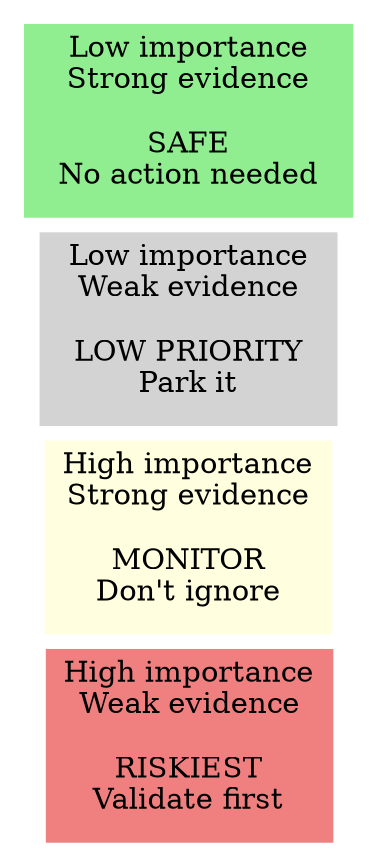

# Assumption Mapping Reference

## The Four Dimensions

Surface assumptions across four dimensions - ask about each one at a time:

| Dimension | Question to ask |
|---|---|
| **Desirability** | What must be true about what users want? |
| **Viability** | What must be true about the business model or market? |
| **Feasibility** | What must be true about what we can build? |
| **Usability** | What must be true about how users will interact with it? |

## The 2x2 Map

For each assumption identified, ask:
1. How important is this to the opportunity succeeding? (high / medium / low)
2. How much evidence do we have that it's true? (strong / weak / none)



## Validation Ideas

For each high-importance / weak-evidence assumption, ask: **what's the cheapest way to test this?**

Common validation approaches:
- **User interview** - 5 conversations, 1 week, ~0 cost
- **Fake door test** - add a button, measure clicks before building
- **Concierge MVP** - do it manually first, see if users value it
- **Prototype test** - clickable mockup, no code
- **Data pull** - check existing analytics for signal
- **Competitor analysis** - has someone else already validated this?

## Output Format

```markdown
## High importance / weak evidence (riskiest - validate first)
| Assumption | Dimension | Evidence so far | Validation idea |
|---|---|---|---|
| [Assumption] | Desirability / Viability / Feasibility / Usability | [What we know] | [Cheapest test] |

## High importance / strong evidence (monitor)
| Assumption | Dimension | Evidence so far |
|---|---|---|

## Low importance / weak evidence (low priority)
| Assumption | Dimension | Evidence so far |
|---|---|---|

## Low importance / strong evidence (safe)
| Assumption | Dimension | Evidence so far |
|---|---|---|
```
